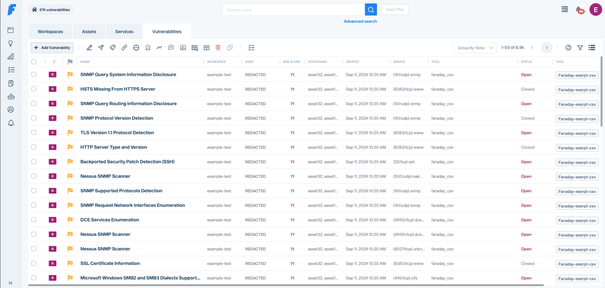
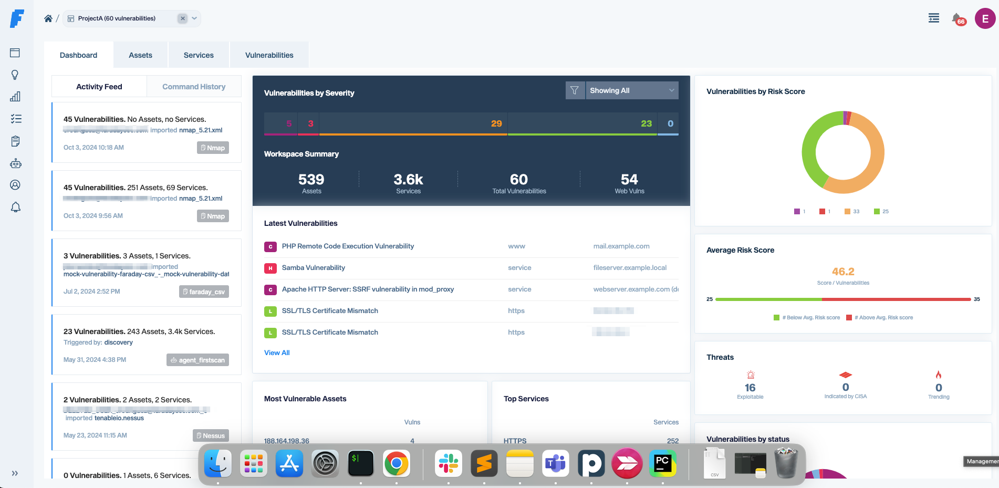

# 


---


### Open Source Vulnerability Manager

Security has two difficult tasks: designing smart ways of getting new information, and keeping track of findings to improve remediation efforts. With Faraday, you may focus on discovering vulnerabilities while we help you with the rest. Just use it in your terminal and get your work organized on the run.
Faraday was made to let you take advantage of the available tools in the community in a truly multiuser way.

Faraday aggregates and normalizes the data you load, allowing exploring it into different visualizations that are useful to managers and analysts alike.





To read about the latest features check out the [release notes](https://github.com/infobyte/faraday/blob/master/RELEASE.md)!


## Install

---

### Docker-compose

The easiest way to get faraday up and running is using our docker-compose

```shell
$ wget https://raw.githubusercontent.com/infobyte/faraday/master/docker-compose.yaml
$ docker-compose up
```
If you want to customize, you can find an example config over here [Link](https://docs.faradaysec.com/Install-guide-Docker/)


### Docker

You need to have a [Postgres](https://github.com/infobyte/faraday/wiki/Install-Guide)  running first.

```shell
 $ docker run \
     -v $HOME/.faraday:/home/faraday/.faraday \
     -p 5985:5985 \
     -e PGSQL_USER='postgres_user' \
     -e PGSQL_HOST='postgres_ip' \
     -e PGSQL_PASSWD='postgres_password' \
     -e PGSQL_DBNAME='postgres_db_name' \
     faradaysec/faraday:latest
  ```

### PyPi
```shell
$ pip3 install faradaysec
$ faraday-manage initdb
$ faraday-server
```

### Binary Packages (Debian/RPM)
You can find the installers on our [releases page](https://github.com/infobyte/faraday/releases)

```shell
$ sudo apt install faraday-server_amd64.deb
# Add your user to the faraday group
$ faraday-manage initdb
$ sudo systemctl start faraday-server
```

Add your user to the `faraday` group and then run

### Source
If you want to run directly from this repo, this is the recommended way:

```shell
$ pip3 install virtualenv
$ virtualenv faraday_venv
$ source faraday_venv/bin/activate
$ git clone git@github.com:infobyte/faraday.git
$ pip3 install .
$ faraday-manage initdb
$ faraday-server
```

Check out our documentation for detailed information on how to install Faraday in all of our supported platforms

For more information about the installation, check out our [Installation Wiki](https://github.com/infobyte/faraday/wiki/Install-Guide).


In your browser now you can go to http://localhost:5985 and login with "faraday" as username, and the password given by the installation process

## Getting Started

---

Learn about Faraday holistic approach and rethink vulnerability management.

- [Centralize your vulnerability data](https://faradaysec.com/centralize-vulnerability-data/)
- [Automate the scanners you need](https://faradaysec.com/automate-scanners/)

### Integrating faraday in your CI/CD

**Setup Bandit and OWASP ZAP in your pipeline**
- [GitHub](https://faradaysec.com/wp-content/whitepapers/Integrating%20Faraday%20-%20Part%20One.pdf) [PDF]
- [Jenkins](https://faradaysec.com/wp-content/whitepapers/Integrating%20Faraday%20-%20Part%20Two.pdf) [PDF]
- [TravisCI ](https://faradaysec.com/wp-content/whitepapers/Integrating%20Faraday%20-%20Part%20Three.pdf) [PDF]

**Setup Bandit, OWASP ZAP and SonarQube in your pipeline**
- [Gitlab](https://faradaysec.com/wp-content/whitepapers/Integrating%20Faraday%20-%20Part%20Four.pdf) [PDF]

## Faraday Cli

---

Faraday-cli is our command line client, providing easy access to the console tools, work in faraday directly from the terminal!

This is a great way to [automate scans](https://docs.faraday-cli.faradaysec.com/),  integrate it to [CI/CD pipeline](https://docs.faraday-cli.faradaysec.com/)  or just get [metrics](https://docs.faraday-cli.faradaysec.com/) from a workspace

```shell
$ pip3 install faraday-cli
```

Check our [faraday-cli](https://github.com/infobyte/faraday-cli) repo

Check out the documentation [here](https://docs.faraday-cli.faradaysec.com/).


## Faraday Agents

---

[Faraday Agents Dispatcher](https://github.com/infobyte/faraday_agent_dispatcher) is a tool that gives [Faraday](https://www.faradaysec.com) the ability to run scanners or tools remotely from the platform and get the results.


## Plugins

---

Connect you favorite tools through our [plugins](https://github.com/infobyte/faraday_plugins). Right now there are more than [80+ supported tools](https://github.com/infobyte/faraday/wiki/Plugin-List), among which you will find:


Missing your favorite one? [Create a Pull Request](https://github.com/infobyte/faraday_plugins/issues)!

There are two Plugin types:

**Console** plugins which interpret the output of the tools you execute.

```shell
$ faraday-cli tool run \"nmap www.exampledomain.com\"
💻 Processing Nmap command
Starting Nmap 7.80 ( https://nmap.org ) at 2021-02-22 14:13 -03
Nmap scan report for www.exampledomain.com (10.196.205.130)
Host is up (0.17s latency).
rDNS record for 10.196.205.130: 10.196.205.130.bc.example.com
Not shown: 996 filtered ports
PORT     STATE  SERVICE
80/tcp   open   http
443/tcp  open   https
2222/tcp open   EtherNetIP-1
3306/tcp closed mysql
Nmap done: 1 IP address (1 host up) scanned in 11.12 seconds
⬆ Sending data to workspace: test
✔ Done

```


**Report** plugins which allows you to import previously generated artifacts like XMLs, JSONs.

```shell
faraday-cli tool report burp.xml
```

Creating custom plugins is super easy, [Read more about Plugins](http://github.com/infobyte/faraday/wiki/Plugin-List).


## API

---
You can access directly to our API,
check out the documentation [here](https://api.faradaysec.com/).


## Links

* Homepage: [faradaysec.com](https://www.faradaysec.com)
* Documentation: [Faraday Docs](https://docs.faradaysec.com)
* Download: [Download .deb/.rpm from releases page](https://github.com/infobyte/faraday/releases)
* Issue tracker and feedback: [Github issue tracker](https://github.com/infobyte/faraday/issues)
* Frequently Asked Questions: [FaradaySEC FAQ](https://docs.faradaysec.com/FAQ/)
* Twitter: [@faradaysec](https://twitter.com/faradaysec)
* Try one of our [Demos](https://demo101.faradaysec.com/#/login)
